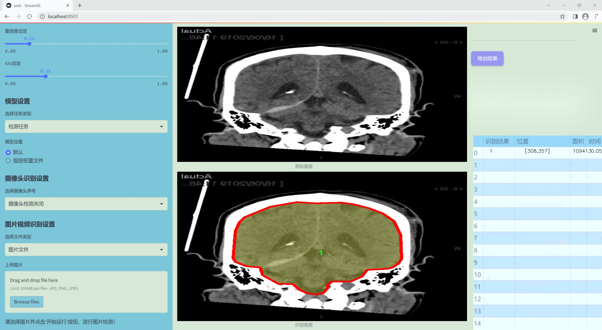
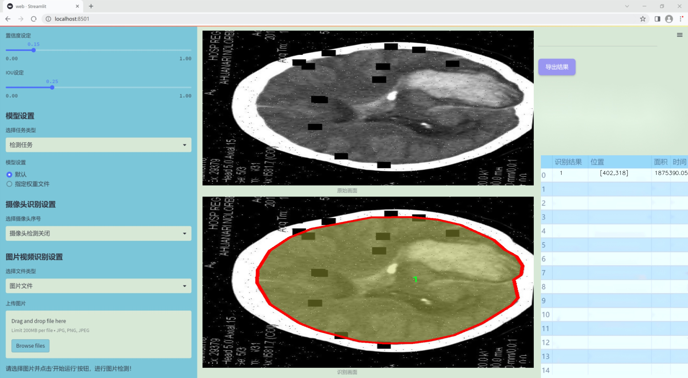
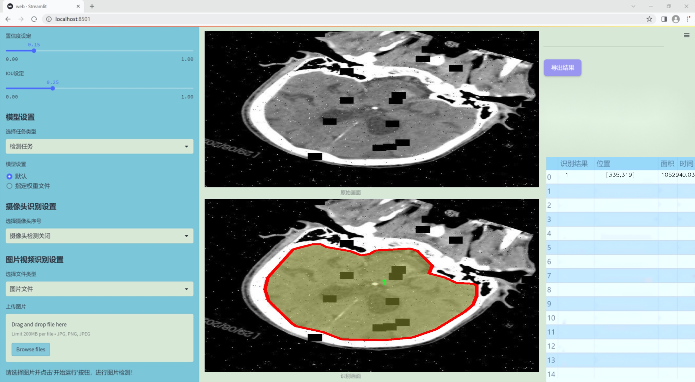
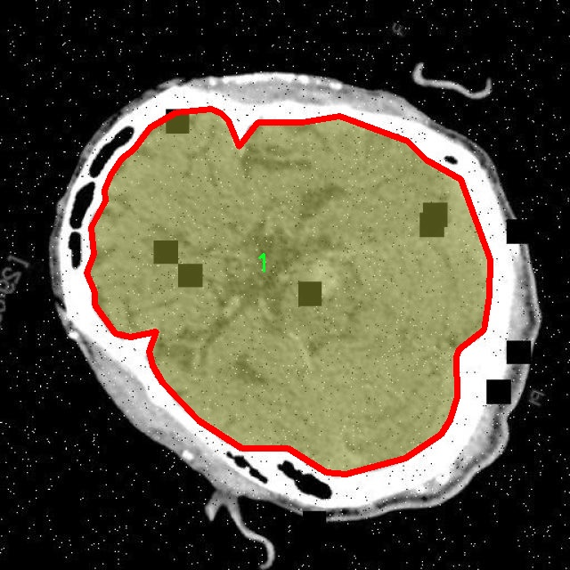
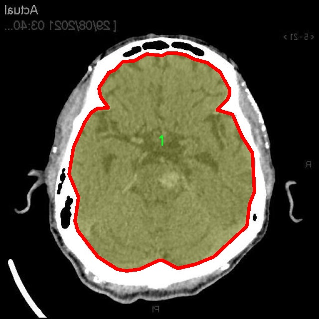
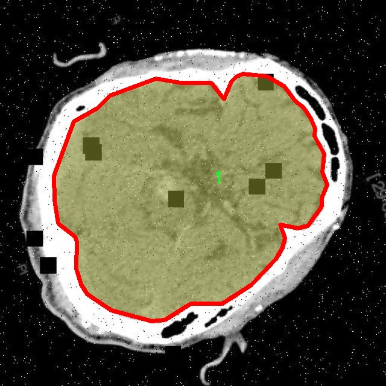
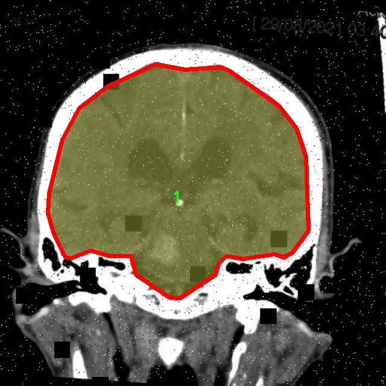
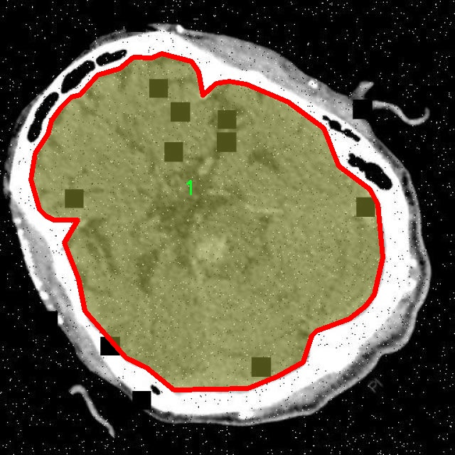

### 1.背景意义

研究背景与意义

脑部CT图像的分割在医学影像分析中扮演着至关重要的角色，尤其是在脑部疾病的诊断和治疗中。随着影像学技术的不断进步，CT扫描已成为评估脑部病变的重要工具。然而，传统的手动分割方法不仅耗时，而且容易受到人为因素的影响，导致分割结果的不一致性。因此，开发高效、准确的自动化分割系统显得尤为重要。

近年来，深度学习技术的迅猛发展为医学图像处理带来了新的机遇。YOLO（You Only Look Once）系列模型因其在目标检测任务中的高效性和准确性而受到广泛关注。YOLOv11作为该系列的最新版本，具备更强的特征提取能力和更快的推理速度，适合处理复杂的医学图像数据。通过对YOLOv11进行改进，可以更好地适应脑部CT图像的特征，从而提高分割的精度和效率。

本研究基于一个包含5500幅脑部CT图像的数据集，数据集中标注了两类重要的脑部结构。这些图像经过精心的预处理和数据增强，以提高模型的泛化能力和鲁棒性。通过利用深度学习技术，我们希望能够实现对脑部CT图像的高效分割，为临床医生提供更为准确的诊断依据。

综上所述，基于改进YOLOv11的脑部CT图像分割系统的研究，不仅具有重要的学术价值，也为临床实践提供了有力的支持。通过该系统的开发与应用，可以有效提升脑部疾病的早期诊断率，从而改善患者的治疗效果和生存质量。

### 2.视频效果

[2.1 视频效果](https://www.bilibili.com/video/BV1ojqBYKE3h/)

### 3.图片效果







##### [项目涉及的源码数据来源链接](https://kdocs.cn/l/cszuIiCKVNis)**

注意：本项目提供训练的数据集和训练教程,由于版本持续更新,暂不提供权重文件（best.pt）,请按照6.训练教程进行训练后实现上图演示的效果。

### 4.数据集信息

##### 4.1 本项目数据集类别数＆类别名

nc: 2
names: ['0', '1']


该项目为【图像分割】数据集，请在【训练教程和Web端加载模型教程（第三步）】这一步的时候按照【图像分割】部分的教程来训练

##### 4.2 本项目数据集信息介绍

本项目数据集信息介绍

本项目旨在改进YOLOv11的脑部CT图像分割系统，因此所使用的数据集专注于“CT脑部分割”这一主题。该数据集包含了大量经过精心标注的脑部CT图像，旨在为模型的训练提供丰富的样本。数据集中包含两个主要类别，分别标记为“0”和“1”，这两个类别代表了不同的脑部结构或病变区域。具体而言，类别“0”通常指代健康的脑组织，而类别“1”则可能对应于存在病变或异常的区域，如肿瘤、出血或其他病理变化。

数据集的构建过程经过严格的筛选和标注，确保每一幅CT图像都能准确反映其对应的类别特征。这一过程不仅提高了数据的质量，也为后续的模型训练提供了坚实的基础。数据集中的图像涵盖了不同年龄段、性别及病理状态的患者，确保了模型在实际应用中的广泛适用性和鲁棒性。

在训练过程中，数据集将被用于监督学习，模型将通过不断调整参数来优化对不同类别的识别能力。通过引入多样化的样本，模型能够学习到更为复杂的特征，从而提高分割的准确性和效率。此外，数据集的规模和多样性也为模型的泛化能力提供了保障，使其能够在面对未见过的CT图像时，依然保持良好的表现。

综上所述，本项目的数据集不仅为YOLOv11的改进提供了必要的训练基础，也为脑部CT图像的自动化分析奠定了重要的理论和实践基础，期待通过这一研究能够推动医学影像分析领域的发展。











### 5.全套项目环境部署视频教程（零基础手把手教学）

[5.1 所需软件PyCharm和Anaconda安装教程（第一步）](https://www.bilibili.com/video/BV1BoC1YCEKi/?spm_id_from=333.999.0.0&vd_source=bc9aec86d164b67a7004b996143742dc)


[5.2 安装Python虚拟环境创建和依赖库安装视频教程（第二步）](https://www.bilibili.com/video/BV1ZoC1YCEBw?spm_id_from=333.788.videopod.sections&vd_source=bc9aec86d164b67a7004b996143742dc)

### 6.改进YOLOv11训练教程和Web_UI前端加载模型教程（零基础手把手教学）

[6.1 改进YOLOv11训练教程和Web_UI前端加载模型教程（第三步）](https://www.bilibili.com/video/BV1BoC1YCEhR?spm_id_from=333.788.videopod.sections&vd_source=bc9aec86d164b67a7004b996143742dc)


按照上面的训练视频教程链接加载项目提供的数据集，运行train.py即可开始训练



     Epoch   gpu_mem       box       obj       cls    labels  img_size
     1/200     20.8G   0.01576   0.01955  0.007536        22      1280: 100%|██████████| 849/849 [14:42<00:00,  1.04s/it]
               Class     Images     Labels          P          R     mAP@.5 mAP@.5:.95: 100%|██████████| 213/213 [01:14<00:00,  2.87it/s]
                 all       3395      17314      0.994      0.957      0.0957      0.0843

     Epoch   gpu_mem       box       obj       cls    labels  img_size
     2/200     20.8G   0.01578   0.01923  0.007006        22      1280: 100%|██████████| 849/849 [14:44<00:00,  1.04s/it]
               Class     Images     Labels          P          R     mAP@.5 mAP@.5:.95: 100%|██████████| 213/213 [01:12<00:00,  2.95it/s]
                 all       3395      17314      0.996      0.956      0.0957      0.0845

     Epoch   gpu_mem       box       obj       cls    labels  img_size
     3/200     20.8G   0.01561    0.0191  0.006895        27      1280: 100%|██████████| 849/849 [10:56<00:00,  1.29it/s]
               Class     Images     Labels          P          R     mAP@.5 mAP@.5:.95: 100%|███████   | 187/213 [00:52<00:00,  4.04it/s]
                 all       3395      17314      0.996      0.957      0.0957      0.0845


###### [项目数据集下载链接](https://kdocs.cn/l/cszuIiCKVNis)

### 7.原始YOLOv11算法讲解


##### YOLO11介绍

Ultralytics YOLO11是一款尖端的、最先进的模型，它在之前YOLO版本成功的基础上进行了构建，并引入了新功能和改进，以进一步提升性能和灵活性。
**YOLO11设计快速、准确且易于使用，使其成为各种物体检测和跟踪、实例分割、图像分类以及姿态估计任务的绝佳选择。**


**结构图如下：**


##### **C3k2**

**C3k2，结构图如下**


**C3k2，继承自类`C2f，其中通过c3k设置False或者Ture来决定选择使用C3k还是`**Bottleneck


**实现代码** **ultralytics/nn/modules/block.py**

##### C2PSA介绍

**借鉴V10 PSA结构，实现了C2PSA和C2fPSA，最终选择了基于C2的C2PSA（可能涨点更好？）**


**实现代码** **ultralytics/nn/modules/block.py**

##### Detect介绍

**分类检测头引入了DWConv（更加轻量级，为后续二次创新提供了改进点），结构图如下（和V8的区别）：**


### 8.200+种全套改进YOLOV11创新点原理讲解

#### 8.1 200+种全套改进YOLOV11创新点原理讲解大全

由于篇幅限制，每个创新点的具体原理讲解就不全部展开，具体见下列网址中的改进模块对应项目的技术原理博客网址【Blog】（创新点均为模块化搭建，原理适配YOLOv5~YOLOv11等各种版本）

[改进模块技术原理博客【Blog】网址链接](https://gitee.com/qunmasj/good)


#### 8.2 精选部分改进YOLOV11创新点原理讲解

###### 这里节选部分改进创新点展开原理讲解(完整的改进原理见上图和[改进模块技术原理博客链接](https://gitee.com/qunmasj/good)【如果此小节的图加载失败可以通过CSDN或者Github搜索该博客的标题访问原始博客，原始博客图片显示正常】
### 可变性卷积DCN简介
卷积神经网络由于其构建模块中固定的几何结构，本质上受限于模型几何变换。为了提高卷积神经网络的转换建模能力，《Deformable Convolutional Networks》作者提出了两个模块：可变形卷积（deformable convolution）和可变形RoI池（deformable RoI pooling）。这两个模块均基于用额外的偏移来增加模块中的空间采样位置以及从目标任务中学习偏移的思想，而不需要额外的监督。

第一次证明了在深度神经网络中学习密集空间变换（dense spatial transformation）对于复杂的视觉任务是有效的

视觉识别中的一个关键挑战是如何适应对象比例、姿态、视点和零件变形中的几何变化或模型几何变换。一般有两种方法实现：
1）建立具有足够期望变化的训练数据集。这通常通过增加现有的数据样本来实现，例如通过仿射变换。但是训练成本昂贵而且模型参数庞大。
2）使用变换不变（transformation-invariant）的特征和算法。比如比较有名的SIFT(尺度不变特征变换)便是这一类的代表算法。

但以上的方法有两个缺点：
1）几何变换被假定为固定的和已知的，这些先验知识被用来扩充数据，设计特征和算法。为此，这个假设阻止了对具有未知几何变换的新任务的推广，从而导致这些几何变换可能没有被正确建模。
2）对于不变特征和算法进行手动设计，对于过于复杂的变换可能是困难的或不可行的。

卷积神经网络本质上局限于模拟大型未知转换。局限性源于CNN模块的固定几何结构：卷积单元在固定位置对输入特征图进行采样；池化层以固定比率降低特征矩阵分辨率；RoI（感兴趣区域）池化层将RoI分成固定的空间箱（spatial bins）等。缺乏处理几何变换的内部机制。

这种内部机制的缺乏会导致一些问题，举个例子。同一个CNN层中所有激活单元的感受野大小是相同的，但是这是不可取的。因为不同的位置可能对应于具有不同尺度或变形的对象，所以尺度或感受野大小的自适应确定对于具有精细定位的视觉识别是渴望的。

对于这些问题，作者提出了两个模块提高CNNs对几何变换建模的能力。


deformable convolution（可变形卷积）
将2D偏移量添加到标准卷积中的常规网格采样位置，使得采样网格能够自由变形。通过额外的卷积层，从前面的特征映射中学习偏移。因此，变形采用局部、密集和自适应的方式取决于输入特征。


deformable RoI pooling（可变形RoI池化）
为先前RoI池化的常规库（bin）分区中的每个库位置（bin partition）增加了一个偏移量。类似地，偏移是从前面的特征图和感兴趣区域中学习的，从而能够对具有不同形状的对象进行自适应部件定位（adaptive part localization）。

#### Deformable Convolutional Networks
Deformable Convolution
2D卷积由两个步骤组成：
1）在输入特征图x xx上使用规则网格R RR进行采样。
2）把这些采样点乘不同权重w ww后相加。

网格R定义感受野大小和扩张程度，比如内核大小为3x3，扩张程度为1的网格R可以表示为：
R = { ( − 1 , − 1 ) , ( − 1 , 0 ) , … , ( 0 , 1 ) , ( 1 , 1 ) } R = \{(-1,-1),(-1,0),\dots,(0,1),(1,1)\}
R={(−1,−1),(−1,0),…,(0,1),(1,1)}

​
 一般为小数，使用双线性插值进行处理。（把小数坐标分解到相邻的四个整数坐标点来计算结果）


具体操作如图所示：


首先对输入特征层进行一个普通的3x3卷积处理得到偏移域（offset field）。偏移域特征图具有与输入特征图相同的空间分辨率，channels维度2N对应于N个2D（xy两个方向）偏移。其中的N是原输入特征图上所具有的N个channels，也就是输入输出channels保持不变，这里xy两个channels分别对输出特征图上的一个channels进行偏移。确定采样点后就通过与相对应的权重w点乘相加得到输出特征图上该点最终值。

前面也提到过，由于这里xy两个方向所训练出来的偏移量一般来说是一个小数，那么为了得到这个点所对应的数值，会采用双线性插值的方法，从最近的四个邻近坐标点中计算得到该偏移点的数值，公式如下：


具体推理过程见：双线性插值原理

#### Deformable RoI Poolingb
所有基于区域提议（RPN）的对象检测方法都使用RoI池话处理，将任意大小的输入矩形区域转换为固定大小的特征图。


 一般为小数，需要使用双线性插值进行处理。


具体操作如图所示：


当时看这个部分的时候觉得有些突兀，明明RoI池化会将特征层转化为固定尺寸的区域。其实，我个人觉得，这个部分与上述的可变性卷积操作是类似的。这里同样是使用了一个普通的RoI池化操作，进行一些列处理后得到了一个偏移域特征图，然后重新作用于原来的w × H w \times Hw×H的RoI。只不过这里不再是规律的逐行逐列对每个格子进行池化，而是对于格子进行偏移后再池化处理。

#### Postion﹣Sensitive RoI Pooling
除此之外，论文还提出一种PS RoI池化（Postion﹣Sensitive RoI Pooling）。不同于上述可变形RoI池化中的全连接过程，这里使用全卷积替换。

具体操作如图所示：


首先，对于原来的特征图来说，原本是将输入特征图上的RoI区域分成k × k k\times kk×k个bin。而在这里，则是将输入特征图进行卷积操作，分别得到一个channels为k 2 ( C + 1 ) k^{2}(C+1)k (C+1)的得分图（score maps）和一个channels为2 k 2 ( C + 1 ) 2k{2}(C+1)2k 2 (C+1)的偏移域（offset fields），这两个特征矩阵的宽高是与输入特征矩阵相同的。其中，得分图的channels中，k × k k \times kk×k分别表示的是每一个网格，C CC表示的检测对象的类别数目，1表示背景。而在偏移域中的2表示xy两个方向的偏移。
也就是说，在PS RoI池化中，对于RoI的每一个网格都独自占一个通道形成一层得分图，然后其对于的偏移量占两个通道。offset fields得到的偏移是归一化后的偏移，需要通过和deformable RoI pooling中一样的变换方式得到∆ p i j ∆p_{ij}∆p ij，然后对每层得分图进行偏移池化处理。最后处理完的结果就对应着最后输出的一个网格。所以其包含了位置信息。

原文论述为：


#### Understanding Deformable ConvNets
当可变形卷积叠加时，复合变形的效果是深远的。如图所示：


ps：a是标准卷积的固定感受野，b是可变形卷积的适应性感受野。

感受野和标准卷积中的采样位置在整个顶部特征图上是固定的(左)。在可变形卷积中，它们根据对象的比例和形状进行自适应调整(右)。


### 9.系统功能展示

图9.1.系统支持检测结果表格显示

  图9.2.系统支持置信度和IOU阈值手动调节

  图9.3.系统支持自定义加载权重文件best.pt(需要你通过步骤5中训练获得)

  图9.4.系统支持摄像头实时识别

  图9.5.系统支持图片识别

  图9.6.系统支持视频识别

  图9.7.系统支持识别结果文件自动保存

  图9.8.系统支持Excel导出检测结果数据


### 10. YOLOv11核心改进源码讲解

#### 10.1 repvit.py

以下是经过精简和注释的核心代码部分：

```python
import torch
import torch.nn as nn
from timm.models.layers import SqueezeExcite

def _make_divisible(v, divisor, min_value=None):
    """
    确保所有层的通道数是8的倍数。
    :param v: 输入值
    :param divisor: 除数
    :param min_value: 最小值
    :return: 处理后的值
    """
    if min_value is None:
        min_value = divisor
    new_v = max(min_value, int(v + divisor / 2) // divisor * divisor)
    # 确保向下取整不会减少超过10%
    if new_v < 0.9 * v:
        new_v += divisor
    return new_v

class Conv2d_BN(nn.Sequential):
    """
    包含卷积层和批归一化层的组合模块。
    """
    def __init__(self, in_channels, out_channels, kernel_size=1, stride=1, padding=0, dilation=1, groups=1):
        super().__init__()
        # 添加卷积层
        self.add_module('conv', nn.Conv2d(in_channels, out_channels, kernel_size, stride, padding, dilation, groups, bias=False))
        # 添加批归一化层
        self.add_module('bn', nn.BatchNorm2d(out_channels))

    @torch.no_grad()
    def fuse_self(self):
        """
        将卷积层和批归一化层融合为一个卷积层。
        """
        conv, bn = self._modules.values()
        # 计算融合后的权重和偏置
        w = bn.weight / (bn.running_var + bn.eps)**0.5
        w = conv.weight * w[:, None, None, None]
        b = bn.bias - bn.running_mean * bn.weight / (bn.running_var + bn.eps)**0.5
        # 创建新的卷积层
        fused_conv = nn.Conv2d(w.size(1) * conv.groups, w.size(0), w.shape[2:], stride=conv.stride, padding=conv.padding, dilation=conv.dilation, groups=conv.groups)
        fused_conv.weight.data.copy_(w)
        fused_conv.bias.data.copy_(b)
        return fused_conv

class RepViTBlock(nn.Module):
    """
    RepViT块，包含通道混合和token混合。
    """
    def __init__(self, inp, hidden_dim, oup, kernel_size, stride, use_se, use_hs):
        super(RepViTBlock, self).__init__()
        self.identity = stride == 1 and inp == oup
        assert(hidden_dim == 2 * inp)

        if stride == 2:
            # 当步幅为2时，使用token混合
            self.token_mixer = nn.Sequential(
                Conv2d_BN(inp, inp, kernel_size, stride, (kernel_size - 1) // 2, groups=inp),
                SqueezeExcite(inp, 0.25) if use_se else nn.Identity(),
                Conv2d_BN(inp, oup, ks=1, stride=1, pad=0)
            )
            # 通道混合
            self.channel_mixer = nn.Sequential(
                Conv2d_BN(oup, 2 * oup, 1, 1, 0),
                nn.GELU() if use_hs else nn.Identity(),
                Conv2d_BN(2 * oup, oup, 1, 1, 0)
            )
        else:
            assert(self.identity)
            self.token_mixer = nn.Sequential(
                Conv2d_BN(inp, inp, 3, 1, 1, groups=inp),
                SqueezeExcite(inp, 0.25) if use_se else nn.Identity(),
            )
            self.channel_mixer = nn.Sequential(
                Conv2d_BN(inp, hidden_dim, 1, 1, 0),
                nn.GELU() if use_hs else nn.Identity(),
                Conv2d_BN(hidden_dim, oup, 1, 1, 0)
            )

    def forward(self, x):
        # 前向传播
        return self.channel_mixer(self.token_mixer(x))

class RepViT(nn.Module):
    """
    RepViT模型类，包含多个RepViTBlock。
    """
    def __init__(self, cfgs):
        super(RepViT, self).__init__()
        self.cfgs = cfgs
        input_channel = self.cfgs[0][2]
        # 构建初始层
        layers = [Conv2d_BN(3, input_channel // 2, 3, 2, 1), nn.GELU(),
                  Conv2d_BN(input_channel // 2, input_channel, 3, 2, 1)]
        # 构建RepViT块
        for k, t, c, use_se, use_hs, s in self.cfgs:
            output_channel = _make_divisible(c, 8)
            exp_size = _make_divisible(input_channel * t, 8)
            layers.append(RepViTBlock(input_channel, exp_size, output_channel, k, s, use_se, use_hs))
            input_channel = output_channel
        self.features = nn.ModuleList(layers)

    def forward(self, x):
        # 前向传播，返回特征
        for f in self.features:
            x = f(x)
        return x

def repvit_m2_3(weights=''):
    """
    构建RepViT模型的特定配置。
    """
    cfgs = [
        [3, 2, 80, 1, 0, 1],
        [3, 2, 80, 0, 0, 1],
        # 省略其他配置...
        [3, 2, 640, 0, 1, 2],
        [3, 2, 640, 1, 1, 1],
    ]
    model = RepViT(cfgs)
    if weights:
        model.load_state_dict(torch.load(weights)['model'])
    return model

if __name__ == '__main__':
    model = repvit_m2_3('repvit_m2_3_distill_450e.pth')
    inputs = torch.randn((1, 3, 640, 640))
    res = model(inputs)
    for i in res:
        print(i.size())
```

### 代码说明：
1. **_make_divisible**: 确保通道数是8的倍数，常用于卷积层的设计。
2. **Conv2d_BN**: 自定义的卷积层与批归一化层的组合，支持融合操作以提高推理速度。
3. **RepViTBlock**: 代表性ViT块，包含token混合和通道混合的操作。
4. **RepViT**: 整个模型的定义，包含多个RepViTBlock，构建了网络的特征提取部分。
5. **repvit_m2_3**: 构建特定配置的RepViT模型，并可加载预训练权重。

这段代码实现了一个高效的卷积神经网络结构，适用于图像分类等任务。

这个文件 `repvit.py` 实现了一个名为 RepViT 的深度学习模型，主要用于图像处理任务。该模型的设计灵感来源于 MobileNetV3，并结合了残差网络的结构。文件中包含了多个类和函数，下面是对其主要部分的逐步分析。

首先，文件导入了必要的库，包括 PyTorch 的神经网络模块、NumPy 和 timm 库中的 SqueezeExcite 层。接着，定义了一个 `replace_batchnorm` 函数，该函数用于遍历模型的子模块，将 BatchNorm2d 层替换为 Identity 层，从而在模型推理时提高效率。

接下来，定义了一个 `_make_divisible` 函数，确保每一层的通道数是 8 的倍数，这在某些模型架构中是一个常见的要求。这个函数会根据输入的值和最小值进行调整，以确保符合这个条件。

然后，定义了一个 `Conv2d_BN` 类，它是一个组合了卷积层和批归一化层的顺序容器。该类在初始化时创建卷积层和批归一化层，并对批归一化层的权重进行初始化。它还实现了一个 `fuse_self` 方法，用于将卷积层和批归一化层融合为一个卷积层，以减少计算量。

接下来是 `Residual` 类，它实现了残差连接的功能。在前向传播中，如果模型处于训练状态且设置了丢弃率，它会随机选择是否将输入与经过处理的输出相加。这个类同样实现了 `fuse_self` 方法，用于在推理时融合卷积层和残差连接。

`RepVGGDW` 类是一个更复杂的模块，结合了深度可分离卷积和残差连接。它的前向传播中会将两个卷积的输出相加，并加上输入，形成残差连接。该类也实现了 `fuse_self` 方法。

`RepViTBlock` 类是 RepViT 模型的基本构建块，包含了通道混合和标记混合的功能。根据步幅的不同，它会选择不同的结构来处理输入数据。

`RepViT` 类是整个模型的核心，它根据给定的配置构建模型的各个层。配置包含了每个块的参数，如卷积核大小、扩展因子、输出通道数等。模型的前向传播方法会返回不同尺度的特征图，以便后续处理。

此外，文件中还定义了 `switch_to_deploy` 方法，用于在推理阶段替换 BatchNorm 层为 Identity 层，以提高推理速度。

`update_weight` 函数用于更新模型的权重，将预训练模型的权重加载到当前模型中。

最后，文件提供了多个函数（如 `repvit_m0_9`, `repvit_m1_0`, `repvit_m1_1`, `repvit_m1_5`, `repvit_m2_3`）来构建不同配置的 RepViT 模型。这些函数接受权重文件路径作为参数，并在构建模型时加载相应的权重。

在 `__main__` 部分，代码实例化了一个 RepViT 模型，并对一个随机输入进行前向传播，打印输出特征图的尺寸。这部分代码用于测试模型的构建和前向传播是否正常工作。

总体而言，这个文件实现了一个高效的图像处理模型，结合了现代卷积神经网络的设计理念，适用于各种计算机视觉任务。

#### 10.2 VanillaNet.py

以下是经过简化并注释的核心代码部分：

```python
import torch
import torch.nn as nn
import torch.nn.functional as F
from timm.layers import weight_init

# 定义激活函数类
class Activation(nn.ReLU):
    def __init__(self, dim, act_num=3, deploy=False):
        super(Activation, self).__init__()
        self.deploy = deploy
        # 权重参数初始化
        self.weight = torch.nn.Parameter(torch.randn(dim, 1, act_num * 2 + 1, act_num * 2 + 1))
        self.bn = nn.BatchNorm2d(dim, eps=1e-6)  # 批归一化
        self.dim = dim
        self.act_num = act_num
        weight_init.trunc_normal_(self.weight, std=.02)  # 权重初始化

    def forward(self, x):
        # 前向传播
        if self.deploy:
            return F.conv2d(
                super(Activation, self).forward(x), 
                self.weight, None, padding=(self.act_num * 2 + 1) // 2, groups=self.dim)
        else:
            return self.bn(F.conv2d(
                super(Activation, self).forward(x),
                self.weight, padding=self.act_num, groups=self.dim))

    def switch_to_deploy(self):
        # 切换到部署模式，融合批归一化
        if not self.deploy:
            kernel, bias = self._fuse_bn_tensor(self.weight, self.bn)
            self.weight.data = kernel
            self.bias = torch.nn.Parameter(torch.zeros(self.dim))
            self.bias.data = bias
            self.__delattr__('bn')  # 删除bn属性
            self.deploy = True

    def _fuse_bn_tensor(self, weight, bn):
        # 融合批归一化的权重和偏置
        running_mean = bn.running_mean
        running_var = bn.running_var
        gamma = bn.weight
        beta = bn.bias
        eps = bn.eps
        std = (running_var + eps).sqrt()
        t = (gamma / std).reshape(-1, 1, 1, 1)
        return weight * t, beta - running_mean * gamma / std

# 定义基本模块Block
class Block(nn.Module):
    def __init__(self, dim, dim_out, act_num=3, stride=2, deploy=False):
        super().__init__()
        self.deploy = deploy
        # 根据是否部署选择不同的卷积层
        if self.deploy:
            self.conv = nn.Conv2d(dim, dim_out, kernel_size=1)
        else:
            self.conv1 = nn.Sequential(
                nn.Conv2d(dim, dim, kernel_size=1),
                nn.BatchNorm2d(dim, eps=1e-6),
            )
            self.conv2 = nn.Sequential(
                nn.Conv2d(dim, dim_out, kernel_size=1),
                nn.BatchNorm2d(dim_out, eps=1e-6)
            )
        self.pool = nn.MaxPool2d(stride) if stride != 1 else nn.Identity()  # 池化层
        self.act = Activation(dim_out, act_num)  # 激活函数

    def forward(self, x):
        # 前向传播
        if self.deploy:
            x = self.conv(x)
        else:
            x = self.conv1(x)
            x = F.leaky_relu(x, negative_slope=1)  # 使用Leaky ReLU激活
            x = self.conv2(x)

        x = self.pool(x)  # 池化
        x = self.act(x)  # 激活
        return x

# 定义VanillaNet网络结构
class VanillaNet(nn.Module):
    def __init__(self, in_chans=3, num_classes=1000, dims=[96, 192, 384, 768], strides=[2, 2, 2, 1], deploy=False):
        super().__init__()
        self.deploy = deploy
        # 网络的初始层
        if self.deploy:
            self.stem = nn.Sequential(
                nn.Conv2d(in_chans, dims[0], kernel_size=4, stride=4),
                Activation(dims[0])
            )
        else:
            self.stem1 = nn.Sequential(
                nn.Conv2d(in_chans, dims[0], kernel_size=4, stride=4),
                nn.BatchNorm2d(dims[0], eps=1e-6),
            )
            self.stem2 = nn.Sequential(
                nn.Conv2d(dims[0], dims[0], kernel_size=1, stride=1),
                nn.BatchNorm2d(dims[0], eps=1e-6),
                Activation(dims[0])
            )

        self.stages = nn.ModuleList()  # 存储各个Block
        for i in range(len(strides)):
            stage = Block(dim=dims[i], dim_out=dims[i + 1], stride=strides[i], deploy=deploy)
            self.stages.append(stage)

    def forward(self, x):
        # 前向传播
        if self.deploy:
            x = self.stem(x)
        else:
            x = self.stem1(x)
            x = F.leaky_relu(x, negative_slope=1)
            x = self.stem2(x)

        for stage in self.stages:
            x = stage(x)  # 依次通过每个Block
        return x

# 示例用法
if __name__ == '__main__':
    inputs = torch.randn((1, 3, 640, 640))  # 随机输入
    model = VanillaNet()  # 创建模型
    pred = model(inputs)  # 前向传播
    print(pred.size())  # 输出预测结果的尺寸
```

### 代码说明：
1. **Activation类**：自定义的激活函数类，包含了卷积操作和批归一化的融合。
2. **Block类**：网络的基本构建模块，包含卷积层、池化层和激活函数。
3. **VanillaNet类**：整个网络结构的定义，包含初始层和多个Block的堆叠。
4. **前向传播**：在每个类中实现了`forward`方法，定义了数据如何通过网络流动。
5. **示例用法**：在主程序中创建一个随机输入并通过模型进行前向传播，输出结果的尺寸。

这个程序文件 `VanillaNet.py` 实现了一个名为 VanillaNet 的深度学习模型，主要用于图像处理任务。该模型是基于 PyTorch 框架构建的，包含了一些自定义的层和模块，旨在提高模型的灵活性和性能。

首先，文件开头包含了一些版权声明和许可证信息，表明该程序是开源的，并遵循 MIT 许可证。接下来，程序导入了必要的库，包括 PyTorch 的核心模块、神经网络模块、功能模块以及一些用于权重初始化的工具。

文件中定义了多个类和函数。`activation` 类是一个自定义的激活函数类，继承自 ReLU，增加了可学习的权重和偏置。该类在前向传播中使用卷积操作，并根据是否处于部署模式（`deploy`）选择不同的处理方式。此外，`Block` 类是模型的基本构建块，包含卷积层、池化层和激活层，支持不同的步幅和自适应池化。

`VanillaNet` 类是整个模型的主体，包含多个 `Block` 作为其组成部分。构造函数中，模型的输入通道、类别数、各层的维度、丢弃率、激活函数数量、步幅等参数都可以进行配置。模型的前向传播方法定义了输入数据如何通过各个层进行处理，并在特定的尺度下提取特征。

在模型的训练和推理过程中，权重的初始化和批归一化的融合是非常重要的。程序中提供了 `_fuse_bn_tensor` 方法，用于在模型部署时融合卷积层和批归一化层的权重，以提高推理速度。

此外，程序还定义了一些用于创建不同配置的 VanillaNet 模型的函数，例如 `vanillanet_5` 到 `vanillanet_13`，这些函数允许用户通过指定预训练权重来加载模型。

最后，程序的主入口部分展示了如何创建一个 VanillaNet 模型实例，并对随机输入进行推理，输出每个特征图的尺寸。这部分代码可以用作测试和验证模型的基本功能。

总体而言，`VanillaNet.py` 文件展示了一个灵活且可扩展的深度学习模型实现，适用于各种图像处理任务，并且提供了良好的可配置性和可复用性。

#### 10.3 orepa.py

以下是提取出的核心部分代码，并附上详细的中文注释：

```python
import torch
import torch.nn as nn
import torch.nn.functional as F
import numpy as np

# 定义OREPA模块
class OREPA(nn.Module):
    def __init__(self, in_channels, out_channels, kernel_size=3, stride=1, padding=None, groups=1, dilation=1, act=True):
        super(OREPA, self).__init__()
        
        # 初始化参数
        self.in_channels = in_channels
        self.out_channels = out_channels
        self.kernel_size = kernel_size
        self.stride = stride
        self.padding = padding if padding is not None else (kernel_size // 2)
        self.groups = groups
        self.dilation = dilation
        
        # 激活函数
        self.nonlinear = nn.ReLU() if act else nn.Identity()
        
        # 定义卷积层参数
        self.weight_orepa_origin = nn.Parameter(torch.Tensor(out_channels, in_channels // groups, kernel_size, kernel_size))
        self.weight_orepa_avg_conv = nn.Parameter(torch.Tensor(out_channels, in_channels // groups, 1, 1))
        self.weight_orepa_pfir_conv = nn.Parameter(torch.Tensor(out_channels, in_channels // groups, 1, 1))
        
        # 初始化参数
        nn.init.kaiming_uniform_(self.weight_orepa_origin, a=0.0)
        nn.init.kaiming_uniform_(self.weight_orepa_avg_conv, a=0.0)
        nn.init.kaiming_uniform_(self.weight_orepa_pfir_conv, a=0.0)
        
        # 其他参数
        self.vector = nn.Parameter(torch.Tensor(6, out_channels))  # 用于加权不同分支的权重
        
        # 初始化向量
        self.init_vector()

    def init_vector(self):
        # 初始化向量的值
        nn.init.constant_(self.vector[0, :], 0.25)  # origin
        nn.init.constant_(self.vector[1, :], 0.25)  # avg
        nn.init.constant_(self.vector[2, :], 0.0)   # prior
        nn.init.constant_(self.vector[3, :], 0.5)   # 1x1_kxk
        nn.init.constant_(self.vector[4, :], 1.0)   # 1x1
        nn.init.constant_(self.vector[5, :], 0.5)   # dws_conv

    def weight_gen(self):
        # 生成最终的卷积权重
        weight_orepa_origin = self.weight_orepa_origin * self.vector[0, :].view(-1, 1, 1, 1)
        weight_orepa_avg = self.weight_orepa_avg_conv * self.vector[1, :].view(-1, 1, 1, 1)
        weight_orepa_pfir = self.weight_orepa_pfir_conv * self.vector[2, :].view(-1, 1, 1, 1)
        
        # 将所有权重相加
        weight = weight_orepa_origin + weight_orepa_avg + weight_orepa_pfir
        return weight

    def forward(self, inputs):
        # 前向传播
        weight = self.weight_gen()  # 生成权重
        out = F.conv2d(inputs, weight, stride=self.stride, padding=self.padding, dilation=self.dilation, groups=self.groups)
        return self.nonlinear(out)  # 应用激活函数

# 示例：使用OREPA模块
model = OREPA(in_channels=3, out_channels=16)
input_tensor = torch.randn(1, 3, 32, 32)  # 假设输入为1张3通道32x32的图像
output = model(input_tensor)  # 前向传播
print(output.shape)  # 输出形状
```

### 代码注释说明：
1. **OREPA类**：这是一个自定义的神经网络模块，继承自`nn.Module`。它的主要功能是实现一种新的卷积结构，支持多种分支的卷积操作。
2. **初始化方法**：在`__init__`中，定义了输入输出通道、卷积核大小、步幅、填充、分组数和扩张率等参数，并初始化卷积层的权重。
3. **激活函数**：根据参数选择使用ReLU激活函数或恒等函数。
4. **权重生成**：`weight_gen`方法根据不同的分支权重生成最终的卷积权重。
5. **前向传播**：在`forward`方法中，调用`weight_gen`生成权重，并通过`F.conv2d`进行卷积操作，最后应用激活函数。

以上代码展示了OREPA模块的核心功能，并通过示例展示了如何使用该模块。

这个程序文件 `orepa.py` 是一个基于 PyTorch 的深度学习模型实现，主要涉及到一种名为 OREPA（Origin-RepVGG Efficient Pointwise Attention）的卷积神经网络结构。文件中定义了多个类和函数，主要用于构建和训练深度学习模型。

首先，文件导入了必要的库，包括 PyTorch 的核心库、神经网络模块、数学库和 NumPy。接着，定义了一些辅助函数，如 `transI_fusebn` 和 `transVI_multiscale`，这些函数用于处理卷积核和批归一化层的参数转换，以及对卷积核进行多尺度填充。

`OREPA` 类是这个文件的核心类，继承自 `nn.Module`。在其构造函数中，初始化了多个参数，包括输入和输出通道数、卷积核大小、步幅、填充、分组卷积、扩张率等。根据是否部署（`deploy` 参数），它会选择不同的初始化方式。如果是部署模式，则直接使用标准的卷积层；否则，它会初始化多个卷积核参数，并通过 Kaiming 正态分布进行初始化。

在 `OREPA` 类中，定义了 `weight_gen` 方法，该方法生成最终的卷积权重。它通过多个分支的权重加权组合来生成最终的卷积核，这些分支包括原始卷积、平均卷积、1x1 卷积等。`forward` 方法实现了前向传播，使用生成的权重进行卷积操作，并通过非线性激活函数和批归一化层进行处理。

`OREPA_LargeConv` 类实现了大卷积核的 OREPA 结构，允许使用更大的卷积核进行特征提取。它的构造函数和前向传播方法与 `OREPA` 类类似，但在权重生成和卷积操作上有所不同。

`ConvBN` 类是一个简单的卷积加批归一化的组合，支持在部署模式下直接使用卷积层，或者在训练模式下使用卷积和批归一化。

`OREPA_3x3_RepVGG` 类是一个具体的 OREPA 结构实现，专门针对 3x3 卷积核进行设计。它的构造函数中初始化了多个参数，并定义了权重生成方法和前向传播方法。

最后，`RepVGGBlock_OREPA` 类实现了一个复合块，结合了 OREPA 和 SEAttention（Squeeze-and-Excitation Attention）机制。它在前向传播中结合了多个分支的输出，提供了更强的特征表达能力。

整体而言，这个文件实现了一个灵活且高效的卷积神经网络结构，支持多种卷积配置和参数初始化方式，适用于各种计算机视觉任务。

#### 10.4 transformer.py

以下是经过简化和注释的核心代码部分：

```python
import torch
import torch.nn as nn
from functools import partial

# 引入自定义的RepBN和LinearNorm模块
from .prepbn import RepBN, LinearNorm
from ..modules.transformer import TransformerEncoderLayer

# 定义线性归一化和RepBN的组合
ln = nn.LayerNorm
linearnorm = partial(LinearNorm, norm1=ln, norm2=RepBN, step=60000)

class TransformerEncoderLayer_RepBN(TransformerEncoderLayer):
    def __init__(self, c1, cm=2048, num_heads=8, dropout=0, act=..., normalize_before=False):
        # 初始化父类TransformerEncoderLayer
        super().__init__(c1, cm, num_heads, dropout, act, normalize_before)
        
        # 使用线性归一化和RepBN进行归一化
        self.norm1 = linearnorm(c1)
        self.norm2 = linearnorm(c1)

class AIFI_RepBN(TransformerEncoderLayer_RepBN):
    """定义AIFI变换器层。"""

    def __init__(self, c1, cm=2048, num_heads=8, dropout=0, act=nn.GELU(), normalize_before=False):
        """使用指定参数初始化AIFI实例。"""
        super().__init__(c1, cm, num_heads, dropout, act, normalize_before)

    def forward(self, x):
        """AIFI变换器层的前向传播。"""
        c, h, w = x.shape[1:]  # 获取输入张量的通道数、高度和宽度
        pos_embed = self.build_2d_sincos_position_embedding(w, h, c)  # 构建2D位置嵌入
        # 将输入张量从形状[B, C, H, W]展平为[B, HxW, C]
        x = super().forward(x.flatten(2).permute(0, 2, 1), pos=pos_embed.to(device=x.device, dtype=x.dtype))
        # 将输出张量恢复为形状[B, C, H, W]
        return x.permute(0, 2, 1).view([-1, c, h, w]).contiguous()

    @staticmethod
    def build_2d_sincos_position_embedding(w, h, embed_dim=256, temperature=10000.0):
        """构建2D正弦-余弦位置嵌入。"""
        assert embed_dim % 4 == 0, "嵌入维度必须是4的倍数，以便进行2D正弦-余弦位置嵌入"
        # 创建宽度和高度的网格
        grid_w = torch.arange(w, dtype=torch.float32)
        grid_h = torch.arange(h, dtype=torch.float32)
        grid_w, grid_h = torch.meshgrid(grid_w, grid_h, indexing="ij")
        
        pos_dim = embed_dim // 4  # 计算位置嵌入的维度
        omega = torch.arange(pos_dim, dtype=torch.float32) / pos_dim
        omega = 1.0 / (temperature**omega)  # 温度缩放

        # 计算位置嵌入
        out_w = grid_w.flatten()[..., None] @ omega[None]
        out_h = grid_h.flatten()[..., None] @ omega[None]

        # 返回组合的正弦和余弦位置嵌入
        return torch.cat([torch.sin(out_w), torch.cos(out_w), torch.sin(out_h), torch.cos(out_h)], 1)[None]
```

### 代码注释说明：
1. **模块导入**：导入必要的PyTorch模块和自定义模块。
2. **归一化定义**：使用`partial`函数定义了一个结合了线性归一化和RepBN的归一化方法。
3. **TransformerEncoderLayer_RepBN类**：继承自`TransformerEncoderLayer`，在初始化时设置了两个归一化层。
4. **AIFI_RepBN类**：继承自`TransformerEncoderLayer_RepBN`，定义了AIFI变换器层的前向传播方法。
5. **前向传播**：在前向传播中，输入张量被展平并与位置嵌入结合，然后输出恢复为原始形状。
6. **位置嵌入构建**：静态方法`build_2d_sincos_position_embedding`用于生成2D正弦-余弦位置嵌入，确保嵌入维度为4的倍数。

这个程序文件 `transformer.py` 定义了一个基于 Transformer 的编码层，主要用于处理图像或序列数据。文件中引入了 PyTorch 库，并且包含了一些自定义的模块和类。

首先，文件导入了必要的 PyTorch 模块，包括 `torch` 和 `torch.nn`，以及一些功能性模块。接着，它从其他文件中引入了 `RepBN` 和 `LinearNorm`，这些可能是自定义的归一化层。`TransformerEncoderLayer` 和 `AIFI` 也被引入，这表明该文件可能是 Transformer 模型的一部分。

在文件中，使用了 `partial` 函数来创建一个新的归一化函数 `linearnorm`，这个函数结合了 `LayerNorm` 和 `RepBN`，并设置了一个步数参数。接下来，定义了一个名为 `TransformerEncoderLayer_RepBN` 的类，它继承自 `TransformerEncoderLayer`。在其构造函数中，调用了父类的构造函数，并定义了两个归一化层 `norm1` 和 `norm2`，这两个层使用了之前定义的 `linearnorm`。

接下来，定义了 `AIFI_RepBN` 类，它继承自 `TransformerEncoderLayer_RepBN`，并在其构造函数中初始化了一些参数，如通道数、隐藏层大小、头数、丢弃率、激活函数和归一化标志。这个类的主要功能是实现 AIFI Transformer 层。

在 `AIFI_RepBN` 类中，重写了 `forward` 方法，这是模型前向传播的核心部分。输入 `x` 的形状为 `[B, C, H, W]`，表示批量大小、通道数、高度和宽度。首先，提取出通道数、高度和宽度，并调用 `build_2d_sincos_position_embedding` 方法生成二维的正弦余弦位置嵌入。然后，将输入张量展平并调整维度，传递给父类的 `forward` 方法进行处理，最后将输出重新排列为原始的形状。

`build_2d_sincos_position_embedding` 是一个静态方法，用于构建二维的正弦余弦位置嵌入。它首先检查嵌入维度是否可以被4整除，然后生成宽度和高度的网格，并计算出位置嵌入。最终返回的结果是一个包含正弦和余弦值的张量。

总的来说，这个文件实现了一个自定义的 Transformer 编码层，结合了不同的归一化方法，并引入了位置嵌入的概念，以便在处理图像或序列数据时能够更好地捕捉空间或时间信息。

### 11.完整训练+Web前端界面+200+种全套创新点源码、数据集获取


# [下载链接：https://mbd.pub/o/bread/Z5yZmZdy](https://mbd.pub/o/bread/Z5yZmZdy)